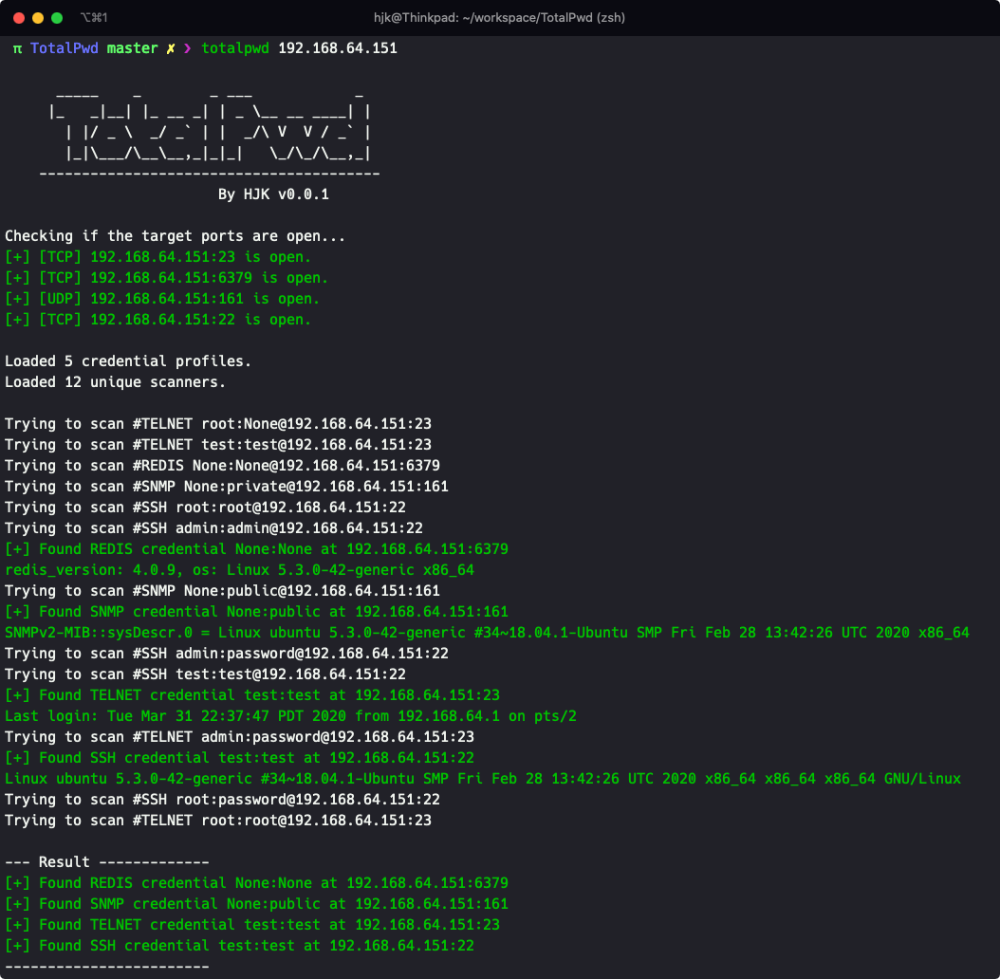

# TotalPwd

TotalPwd 是一款快速扫描目标设备是否存在默认密码（弱口令）的工具

目前支持的扫描类型有
- ssh
- telnet
- snmp
- redis



## 快速开始

安装（也可以直接使用python3 totalpwd.py）
```bash
$ python3 setup.py install
```

对单一IP进行所有扫描
```bash
$ totalpwd 192.168.1.1
```

使用详细模式
```bash
$ totalpwd -v 192.168.1.1
```

指定扫描类型进行扫描
```bash
$ totalpwd -c ssh 192.168.1.1
```

对多个IP的指定端口进行所有扫描
```bash
$ totalpwd -p 22 192.168.1.1 192.168.1.2
```

## 使用说明

查看帮助

```bash
$ totalpwd --help
Usage: totalpwd [OPTIONS] TARGET...

Options:
  --version              Show the version and exit.
  -x, --vendor TEXT      指定设备型号或品牌
  -c, --category TEXT    指定扫描类型
  -p, --port INTEGER     指定扫描端口
  -t, --threads INTEGER  指定线程数量
  --common               使用常见弱口令字典
  -v, --verbose          详细输出模式
  --help                 Show this message and exit.
```

查看版本和支持的扫描类型

```bash
$ totalpwd --version
TotalPwd, Version 0.0.1, By HJK

+--------+----------+------+-----------+
| Vendor | Category | Port | Pwd Count |
+--------+----------+------+-----------+
| COMMON |  common  |  0   |     11    |
|  SNMP  |   snmp   | 161  |     2     |
| REDIS  |  redis   | 6379 |     1     |
|  SSH   |   ssh    |  22  |     5     |
| TELNET |  telnet  |  23  |     4     |
+--------+----------+------+-----------+
```

### 扫描目标

扫描目标支持单个IP、多个IP、子网、指定类型和端口等形式
```bash
$ totalpwd 192.168.1.1

$ totalpwd 192.168.1.1 192.168.1.2

$ totalpwd 192.168.1.1/24

$ totalpwd redis://192.168.1.1:6379
```

### 设备类型

参数：`-x`或`--vendor=`

对应pwds目录中的yml文件的vendor属性

### 扫描类型

参数：`-c`或`--category=`

对应pwds目录中的yml文件的category属性，也和`addons`目录中的插件名称对应，如果不指定则默认使用所有插件

### 扫描端口

参数：`-p`或`--port=`

不指定则使用默认端口

### 线程数量

参数：`-t`或`--threads=`

默认10线程（仅在扫描密码时使用多线程）

### 常见弱口令

参数：`--common`

在匹配的yml文件之外，使用csv文件中常见弱口令进行爆破

### 详细模式

参数：`-v` `-vv` `-vvv`

`v`越多，输出越详细


## 开发说明

项目支持插件化开发，只需要在`addons`目录中添加插件，在`pwds`目录中添加密码信息即可使用

### 添加yml密码（推荐）

例如新增一个思科的snmp默认密码文件，可以在`pwds/snmp`目录下创建`cisco.yml`文件

参考格式：

```yml
auth:
  credentials:
  - username: cisco
    password: cisco
  - username: 用户名和密码可以创建多对
    password: 用户名和密码可以创建多对
category: snmp # 类别必须和插件名称一致
port: 161
vendor: CISCO SNMP
comment: 这是备注，可以备注来源链接
```

### 添加csv密码

如果需要添加多个密码，可以使用csv文件

csv格式：username, password [, vendor, category, port, comment]

用户名和密码必须，设备类型、扫描类型、端口、备注可选

### 开发扫描器插件

如果扫描类型不在已支持的插件中，可以选择自行开发插件。

开发插件需要在`addons`目录中创建py文件，文件名为扫描类型，如`mongo.py`。

同时需要在`pwds`目录中添加对应的密码信息。

格式参考：
```python

# 引入必要的包
import pymongo
from ..settings import opts
from ..scanner import Scanner

# 继承Scanner类，类名和扫描类别保持一致
class MongoScanner(Scanner):
    def __init__(self, pwd, target, username, password):
        super(RedisScanner, self).__init__(pwd, target, username, password)
        # 指定默认端口
        self.port = self.port or 27017

    # 核心扫描方法，成功通常返回服务信息，失败返回False
    def _check(self):
        evidence = "mongodb version xxx"
        return evidence

# 被调用的生成扫描器的方法，注意类名一致
def mkscanner(pwd, target, username, password):
    return MongoScanner(pwd, target, username, password)

```